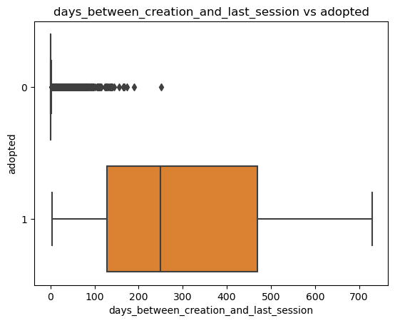
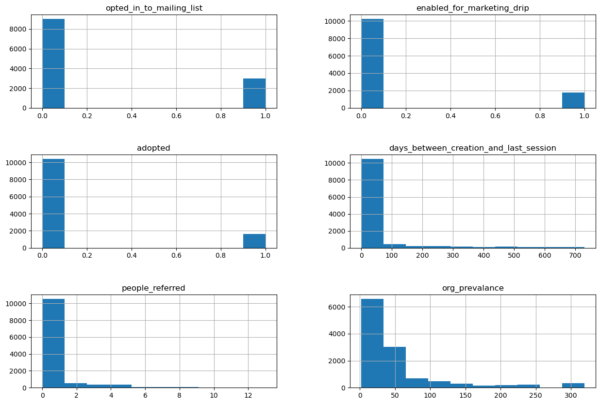
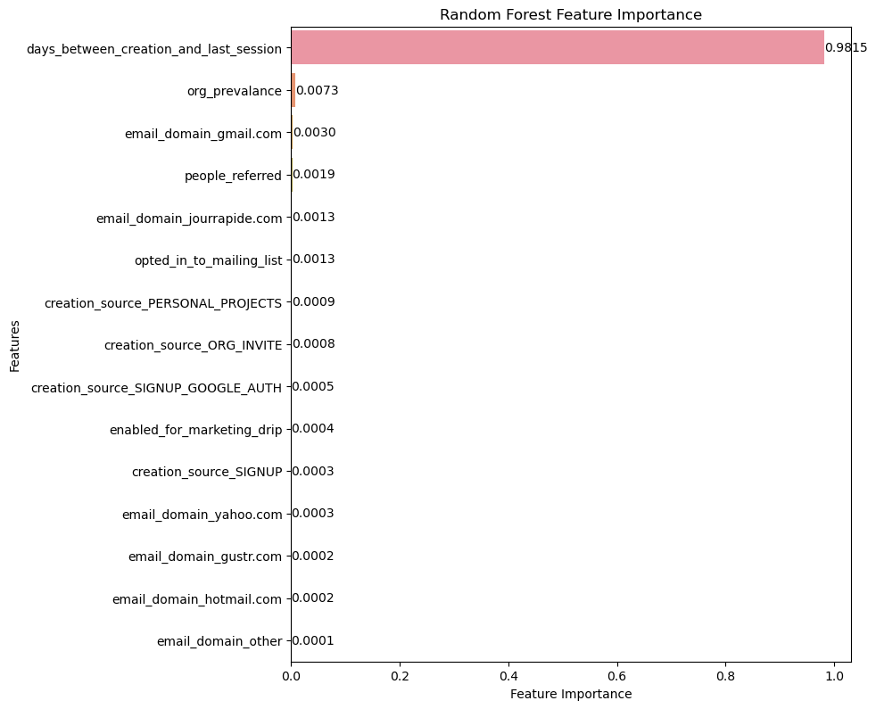

## Problem Statement

Defining  an  "adopted  user"   as  a  user  who   has  logged  into  the  product  on  three  separate
days  in  at  least  one  seven-day  period ,  identify  which  factors  predict  future  user
adoption.

## Feature Engineering

We feature engineered several new columns:
* (adopted) Boolean which shows whether or not a user has adopted the software
* (email_domain) Categorical which shows the domain of the email used to create the account
* (days_between_creation_and_last_session) Numerical Shows the number of days between account creation and last login
* (people_referred) Numerical which shows how many people a specific user referred
* (org_prevalance) Numerical which shows the number of users in from the same organization.

1602 out of 12000 people were labeled as adopted users or ~ 13%

## Imputing Missing Values

There were missing values in the following columns:

* invited_by_user_id
* last_session_creation_time 

For the invited_by_user_id column, we imputed missing values with the number 0 to indicate that they were not invited by another user as user_id starts from 1.

For the last_session_creation_time, we imputed missing values with from the creation_time column as that would the only know time they were logged in. 

## Exploratory Data Analysis

For numerical variables, the most correlated variable to the adopted column is the days_between_creation_and_last_session column

The boxplot of days_between_creation_and_last_session show the correlation very well

All of the numerical and boolean variables are heavily left skewed

## Modeling
The final model metrics are shown below
|Model Name|	f1 score	|test_acc	|roc	|precision	|recall
|:---------:|:---------:|:---------:|:---------:|:---------:|:---------:|
|Random Forest	|0.917	|0.977	|0.996|	0.945|	0.890|

By far the most important feature was 'days between_creation_and_last_session' which 

## Ideas for Future Research

* Defining an "adopted user" as a user who has logged into the product on three separate days in at least one seven-day period might not be the best metric for a user who has 'adopted' the product. The creation times and last session times span over 2 years: May 2012 - May-2014. That means a user who logged in 3 times withina 7 day period in early 2012 but has never logged on since would still be considered an 'adopted user'. A better metric would be one that considers recent logins more heavily. 

* Some more data which could be useful is login length or session logout time. with this data we can see how long a user is logged in for which could be helpful.
