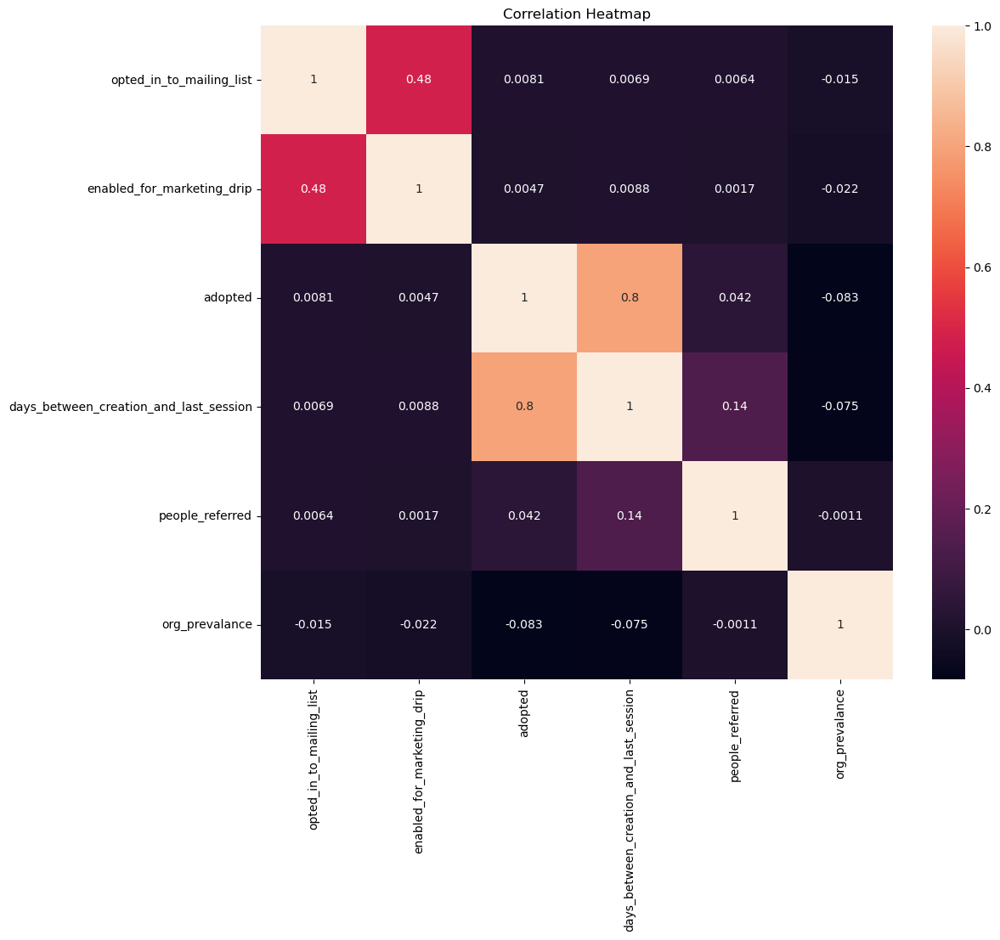
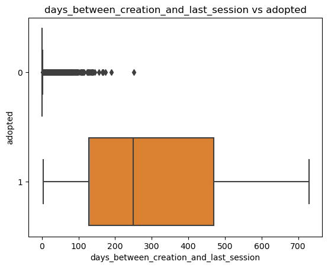
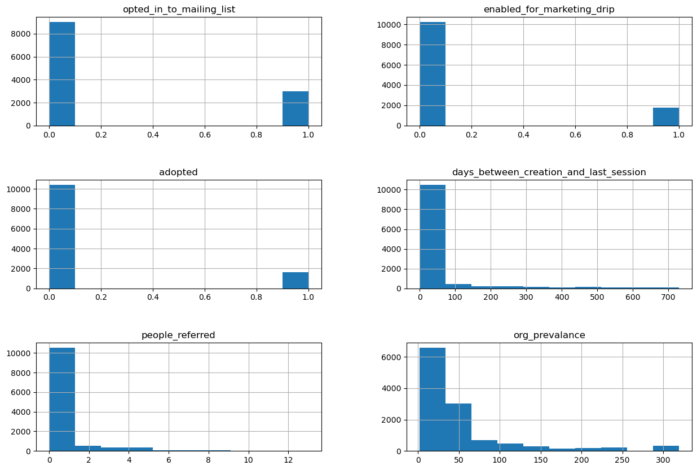
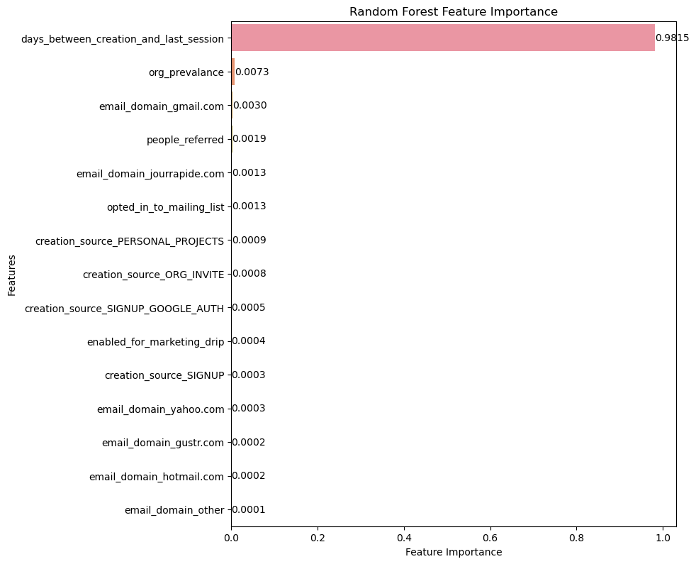

{
 "cells": [
  {
   "cell_type": "markdown",
   "id": "c6e3f4cb",
   "metadata": {},
   "source": [
    "## Problem Statement\n",
    "\n",
    "Defining  an  \"adopted  user\"   as  a  user  who   has  logged  into  the  product  on  three  separate\n",
    "days  in  at  least  one  seven-day  period ,  identify  which  factors  predict  future  user\n",
    "adoption.\n"
   ]
  },
  {
   "cell_type": "markdown",
   "id": "f6cbd3df",
   "metadata": {},
   "source": [
    "## Feature Engineering"
   ]
  },
  {
   "cell_type": "markdown",
   "id": "a671c541",
   "metadata": {},
   "source": [
    "We feature engineered several new columns:\n",
    "* (adopted) Boolean which shows whether or not a user has adopted the software\n",
    "* (email_domain) Categorical which shows the domain of the email used to create the account\n",
    "* (days_between_creation_and_last_session) Numerical Shows the number of days between account creation and last login\n",
    "* (people_referred) Numerical which shows how many people a specific user referred\n",
    "* (org_prevalance) Numerical which shows the number of users in from the same organization."
   ]
  },
  {
   "cell_type": "markdown",
   "id": "6702db27",
   "metadata": {},
   "source": [
    "1602 out of 12000 people were labeled as adopted users or ~ 13%"
   ]
  },
  {
   "cell_type": "markdown",
   "id": "74e6fc9e",
   "metadata": {},
   "source": [
    "## Exploratory Data Analysis"
   ]
  },
  {
   "cell_type": "markdown",
   "id": "5084e98d",
   "metadata": {},
   "source": [
    "For numerical variables, the most correlated variable to the adopted column is the days_between_creation_and_last_session column"
   ]
  },
  {
   "cell_type": "markdown",
   "id": "30cf519d",
   "metadata": {},
   "source": [
    "\n"
   ]
  },
  {
   "cell_type": "markdown",
   "id": "68c8b731",
   "metadata": {},
   "source": [
    "The boxplot of days_between_creation_and_last_session show the correlation very well"
   ]
  },
  {
   "cell_type": "markdown",
   "id": "ae6de4c4",
   "metadata": {},
   "source": [
    ""
   ]
  },
  {
   "cell_type": "markdown",
   "id": "120e59e5",
   "metadata": {},
   "source": [
    "All of the numerical and boolean variables are heavily left skewed"
   ]
  },
  {
   "cell_type": "markdown",
   "id": "36eba8ef",
   "metadata": {},
   "source": [
    ""
   ]
  },
  {
   "cell_type": "markdown",
   "id": "2b837b95",
   "metadata": {},
   "source": [
    "The final model metrics are shown below\n",
    "|Model Name|\tf1 score\t|test_acc\t|roc\t|precision\t|recall\n",
    "|:---------:|:---------:|:---------:|:---------:|:---------:|:---------:|\n",
    "|Random Forest\t|0.917\t|0.977\t|0.996|\t0.945|\t0.890|"
   ]
  },
  {
   "cell_type": "markdown",
   "id": "e166c595",
   "metadata": {},
   "source": [
    "By far the most important feature was 'days between_creation_and_last_session' which "
   ]
  },
  {
   "cell_type": "markdown",
   "id": "3ad0b523",
   "metadata": {},
   "source": [
    ""
   ]
  },
  {
   "cell_type": "markdown",
   "id": "88923213",
   "metadata": {},
   "source": [
    "## Future Research"
   ]
  },
  {
   "cell_type": "markdown",
   "id": "35fb9ca2",
   "metadata": {},
   "source": [
    "Defining an \"adopted user\" as a user who has logged into the product on three separate days in at least one seven-day period might not be the best metric for a user who has 'adopted' the product. The creation times and last session times span over 2 years: May 2012 - May-2014. That means a user who logged in 3 times withina 7 day period in early 2012 but has never logged on since would still be considered an 'adopted user'. A better metric would be one that considers recent logins more heavily. Some more data which could be useful is login length or session logout time. with this data we can see how long a user is logged in for which could be helpful."
   ]
  },
  {
   "cell_type": "code",
   "execution_count": null,
   "id": "a6f5ef8b",
   "metadata": {},
   "outputs": [],
   "source": []
  }
 ],
 "metadata": {
  "kernelspec": {
   "display_name": "Python 3 (ipykernel)",
   "language": "python",
   "name": "python3"
  },
  "language_info": {
   "codemirror_mode": {
    "name": "ipython",
    "version": 3
   },
   "file_extension": ".py",
   "mimetype": "text/x-python",
   "name": "python",
   "nbconvert_exporter": "python",
   "pygments_lexer": "ipython3",
   "version": "3.8.3"
  }
 },
 "nbformat": 4,
 "nbformat_minor": 5
}
